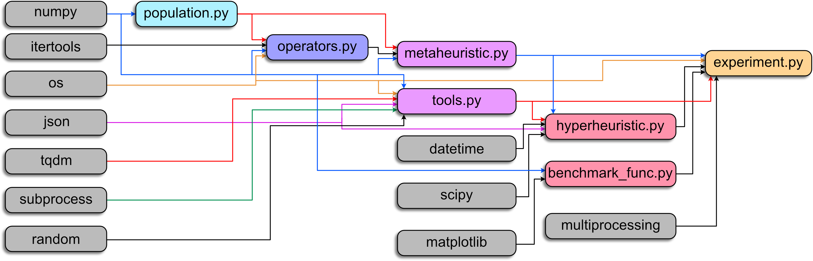

# Final Project for Computational Techniques in Machine Learning

This repository contains the resulting datasets of the work entitled **Hyper-Heuristic based on Transformers for Solving Continuous Optimisation Problems**. It also include the main jupyter file to plot the figures thereby presented.

Team: José M. Tapia-Avitia, A00834191

## Important

Due to the file size limitation of GitHub, it is comprised the dataset of metahueristics used to create the training dataset for the Transformers models. It is comprised as well the folder with the results of the experiments. 

## Requirements
- Python v3.7+
- [CUSTOMHyS framework](https://github.com/jcrvz/customhys.git)
- Standard modules: os, matplotlib, numpy, pandas, scipy.stats, seaborn, tensorflow, transformers

## Files
- **Main figures notebook**: [HyBert-Heuristic.ipynb](./HyBert-Heuristic.ipynb)
- Sample of metaheuristics for create the training dataset (_this folder will be available once unzip the file_): [stored_sequences/](./stored_sequences)
- Results from the proposed approaches (_this folder will be available once unzip the file_): [transformer_experiments/](./transformer_experiments)
- Collection of default heuristics: [collections/default.txt](./collections/default.txt)

## Contact information

José M. Tapia-Avitia - [A00834191@tec.mx](mailto:A00834191@tec.mx)

Distributed under the MIT license. See [LICENSE](./LICENSE) for more information.

# customhys

**Customising optimisation metaheuristics via hyper-heuristic search** (CUSTOMHyS). This framework provides tools for solving, but not limited to, continuous optimisation problems using a hyper-heuristic approach for customising metaheuristics. It contains several approaches that are powered by a strategy based on Simulated Annealing, Artificial Neural Network, or Transformers. Also, several search operators serve as building blocks for tailoring metaheuristics. They were extracted from ten well-known metaheuristics in the literature.

Detailed information about this framework can be found in [1, 2]. Plus, the code for each module is well-documented.

### 🛠 Requirements:
Python 3.7 and higher. Packages: NumPy 1.18.5, SciPy 1.5.0, Matplotlib 3.2.2, json 2.0.9, tqdm 4.47.0, transformers 4.17.0.

## 🧰 Modules

The modules that comprise this framework depend on some basic Python packages, as well as they liaise each other. The module dependency diagram is presented as follows:

**NOTE:** Each module is briefly described below. If you require further information, please check the corresponding source code.

### 🤯 Problems (benchmark functions)

This module includes several benchmark functions as classes to be solved by using optimisation techniques. The class structure is based on Keita Tomochika's repository [optimization-evaluation](https://github.com/keit0222/optimization-evaluation).

Source: [``benchmark_func.py``](./benchmark_func.py)

### 👯‍♂️ Population

This module contains the class Population. A Population object corresponds to a set of agents or individuals within a problem domain. These agents themselves do not explore the function landscape, but they know when to update the position according to a selection procedure.

Source: [``population.py``](./population.py)

### 🦾 Search Operators (low-level heuristics)

This module has a collection of search operators (simple heuristics) extracted from several well-known metaheuristics in the literature. Such operators work over a population, i.e., modify the individuals' positions. 

Source: [``operators.py``](./operators.py)

### 🤖 Metaheuristic (mid-level heuristic)

This module contains the Metaheuristic class. A metaheuristic object implements a set of search operators to guide a population in a search procedure within an optimisation problem.

Source: [``metaheuristic.py``](./metaheuristic.py)

### 👽 Hyper-heuristic (high-level heuristic)

This module contains the Hyperheuristic class. Similar to the Metaheuristic class, but in this case, a collection of search operators is required. A hyper-heuristic object searches within the heuristic space to find the sequence that builds the best metaheuristic for a specific problem.

Source: [``hyperheuristic.py``](./hyperheuristic.py)

### 🏭 Experiment

This module contains the Experiment class.  An experiment object can run several hyper-heuristic procedures for a list of optimisation problems.

Source: [``experiment.py``](./experiment.py)

### 🗜️ Tools

This module contains several functions and methods utilised by many modules in this package.

Source: [``tools.py``](./tools.py)

### 🧠 Neural Networks

This module contains the implementation of neural network models, as well as several methods utilised by for it correct utilisation. It contains the transformers models as well.

Source: [``tools.py``](./tools.py)

## Sponsors

## References

1. [Cruz-Duarte, J.M., Amaya, I., Ortiz-Bayliss, J.C., Connat-Pablos, S.E., and Terashima-Marín, H., A Primary Study on Hyper-Heuristics to Customise Metaheuristics for Continuous Optimisation. CEC'2020. Accepted.](./docfiles/SearchOperators_CEC.pdf)
1. Cruz-Duarte, J.M., Amaya, I., Ortiz-Bayliss, J.C., Connat-Pablos, S.E., Terashima-Marín, H., and Shi, Y., Hyper-Heuristics to Customise Metaheuristics for Continuous Optimisation. Submitted to SWEVO.
